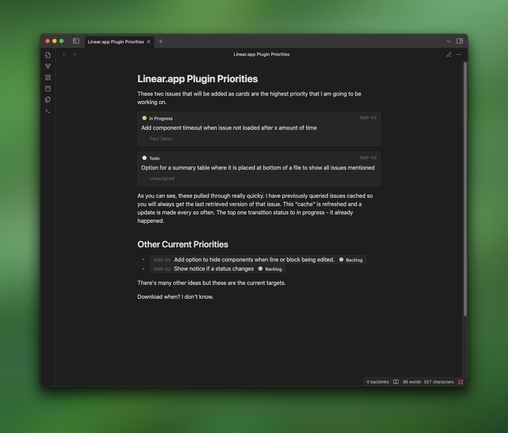

# Linear Issues

> [!WARNING]
> This plugin is still in **Beta**, so issues may still occur. Use at your own risk - I am not be responsible for loss of content, or damaged vaults.

An unofficial plugin for [Obsidian.md](http://obsidian.md) that allows you to embed your [Linear](https://linear.app) issues and tasks within an Obsidian document.



## Installation

Right now it is only possible to install this plugin manually, once I am sure of a stable version the plugin will be available from the community plugin list.

### Manual Install

1. Go to the GitHub Releases Page.
2. Download from the last release the 3 files:
    - `main.js`
    - `manifest.json`
    - `styles.css`
3. Access to the folder of your Obsidian.md vault.
4. Browse to the folder `.obsidian\plugins`.
    - This folder may be hidden in some operating systems.
5. Create the folder `linear-obsidian-plugin`.
6. Move the 3 downloaded files in the folder `linear-obsidian-plugin`.

## Quick Start

Authenticate with Linear by going to `Obsidian` > `Settings` > `Linear` and click `Auth`. This will redirect you to Linear and allow you to authorise Obsidian to have access to your issues. Once approved, Linear will then reopen Obsidian.

Issues and tasks can be added by referencing the identifier of an issue and including it in markup, like `[AMP-1]`.

Mark up reacts in different ways depending on how you include it in your document. Current there are two types of presentation;

1. **Card** - Issues are presented as a card if they are the only mark up in a paragraph block or line.
2. **Inline** - Any issues that are surrounded by content, or included on a non-paragraph block such as a line, will be presented as inline to be readable with the content.

Below is an short example document of how these may look.

```md
**Cards** presented issues are issues that are added to their own paragraph and provide a larger view of the issue. This is especially useful when you want to display an issue with some prominence and have larger click footprint. Below is an example of how that is included.

[AMP-34]

**Inline** issues, are when the issue identifier is added to the content. Be in it as part of a paragraph, list or some other block of content. For example [AMP-56] would render as an inline issue. And the below items in the list would contain inline issues;

1. A **top priority** issue so it is placed first: [AMP-65]
2. This doesn't have an issue, but the one below is still inline.
3. [AMP-43]
4. A final example [AMP-67] but *we're not limited to these*.
```

## Planned Features

There are several features planned, here is a shortlist of them in no particular order;

- Tabular view with several issues being added to a view.
- A GraphQL block to allow for custom queries using the [Linear API](https://developers.linear.app/docs/graphql/working-with-the-graphql-api).
- Ability to update and change your issues from within Obsidian.
- Creation of Issues from within Obsidian.
- Sync of to-dos with issues and the issues themselves.

